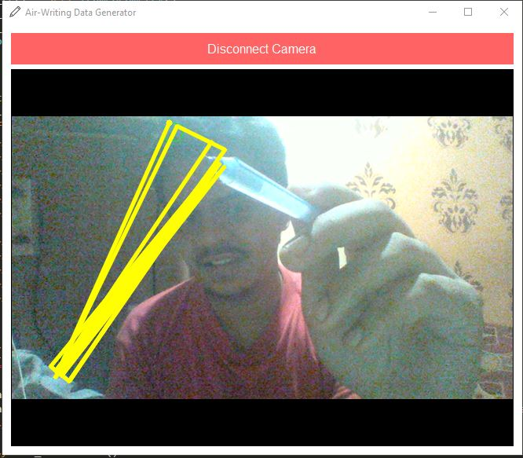

## Air writer in python

### A try to make writing in air possible to send messages ,signatures etc which can be used in modern day technology as an enhancement to keyboard writing in mobiles and monitors.
  
Modules required - 
PyQt5  cv2  os  re  flask

  
### After installation do python app.py and connect camera to view the output  

